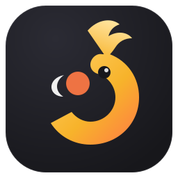
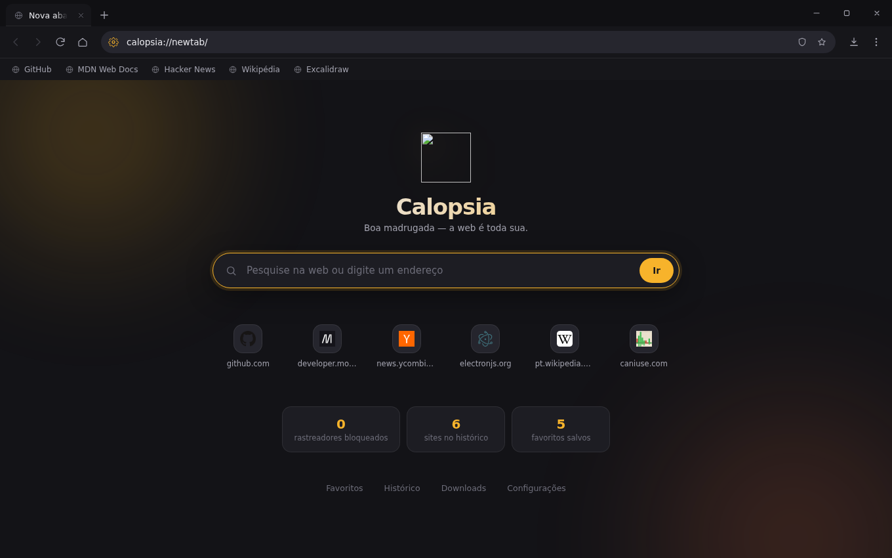
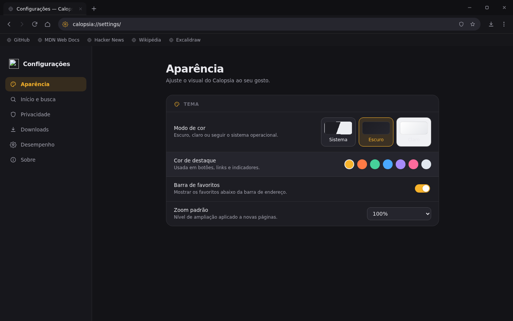
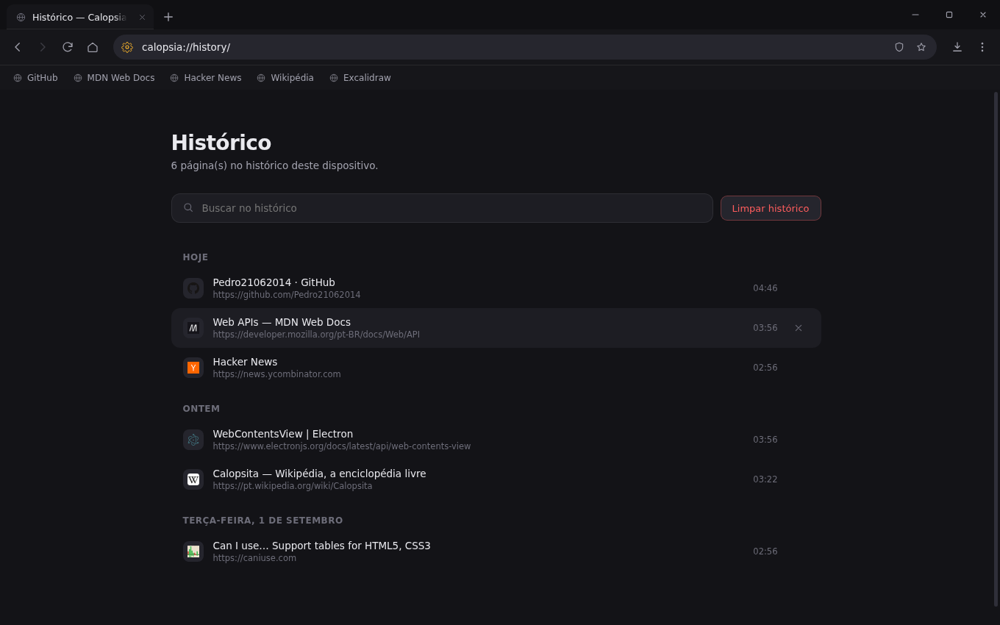
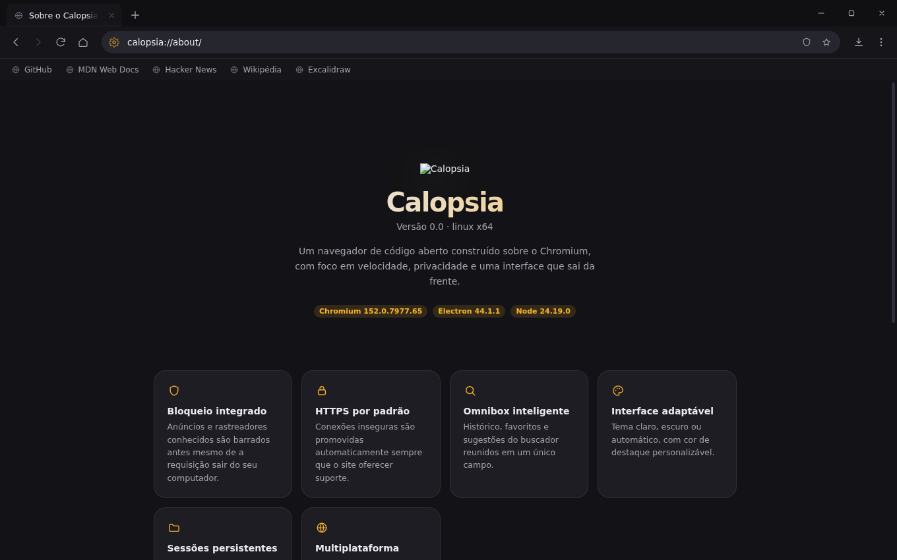

<div align="center">



# Calopsia

**Um navegador multiplataforma baseado em Chromium.**
Rápido, privado e com uma interface que sai da frente.

[](https://github.com/Pedro21062014/CALOPSIA/actions/workflows/build.yml)
[](LICENSE)
[](https://electronjs.org)
[](#instalação)

</div>

<div align="center">

</div>

---

## Sobre

O Calopsia é um navegador de código aberto construído sobre o **Chromium** (via Electron).
Ele não é um "wrapper" de site: cada aba é um `WebContentsView` isolado, gerenciado pelo
processo principal, com a mesma arquitetura multiprocesso do Chrome — a interface roda em
um contexto separado e nunca compartilha memória com as páginas.

## Recursos

| | |
|---|---|
| **Abas reais** | Isolamento por processo, reordenação por arrastar-e-soltar, fixar, silenciar, duplicar e restaurar abas fechadas |
| **Omnibox inteligente** | Histórico, favoritos e sugestões do buscador em um campo só, com navegação por teclado |
| **Bloqueio integrado** | Filtro de anúncios e rastreadores por domínio, com contador por página e exceções por site |
| **HTTPS por padrão** | Promoção automática de `http://` para `https://`, com exceção para redes locais |
| **Privacidade** | Cabeçalhos DNT e Sec-GPC, janela anônima com sessão efêmera, limpeza de dados ao sair |
| **Gerenciador de downloads** | Progresso ao vivo, pausar/cancelar, abrir a pasta, histórico persistente |
| **Favoritos e histórico** | Barra de favoritos, páginas internas de gerenciamento com busca e agrupamento por dia |
| **Interface adaptável** | Tema claro/escuro/automático, cor de destaque personalizável, layout frameless nativo em cada SO |
| **Páginas internas** | `calopsia://newtab`, `settings`, `history`, `bookmarks`, `downloads`, `about` — servidas por protocolo próprio |
| **Sessões** | Restaura janelas, abas e ordem exatamente como estavam |

## Telas

<table>
<tr>
<td width="50%"><p align="center"><sub><code>calopsia://settings</code></sub></p></td>
<td width="50%"><p align="center"><sub><code>calopsia://history</code></sub></p></td>
</tr>
<tr>
<td colspan="2"><p align="center"><sub><code>calopsia://about</code></sub></p></td>
</tr>
</table>

## Instalação

Baixe o instalador da sua plataforma na página de [**Releases**](https://github.com/Pedro21062014/CALOPSIA/releases).

| Plataforma | Arquivo | Observação |
|---|---|---|
| Windows 10/11 | `Calopsia-Setup-x.y.z-x64.exe` | Também há versão portátil |
| macOS 11+ | `Calopsia-x.y.z-arm64.dmg` / `-x64.dmg` | Apple Silicon e Intel |
| Linux | `Calopsia-x.y.z-x86_64.AppImage`, `.deb`, `.rpm` | AppImage funciona em qualquer distro |

> As builds **não são assinadas digitalmente**.
> No macOS, rode `xattr -cr /Applications/Calopsia.app` na primeira execução.
> No Windows, clique em *Mais informações → Executar assim mesmo*.

## Desenvolvimento

```bash
git clone https://github.com/Pedro21062014/CALOPSIA.git
cd CALOPSIA

npm install        # instala Electron + electron-builder
npm run icons      # gera build/icon.png
npm start          # abre o navegador
```

### Scripts

| Comando | O que faz |
|---|---|
| `npm start` | Executa o Calopsia em modo desenvolvimento |
| `npm run icons` | Gera `build/icon.png` (usa `build/logo.png` se existir) |
| `npm run smoke` | Sobe o navegador e verifica os invariantes da UI (roda no CI) |
| `npm run screenshots` | Regenera as imagens de `docs/` |
| `npm run pack` | Empacota sem criar instalador (rápido, para testar) |
| `npm run dist` | Gera os instaladores da plataforma atual |
| `npm run dist:win` / `:mac` / `:linux` | Gera para uma plataforma específica |

### Estrutura

```
src/
├── main/                 processo principal (Node.js)
│   ├── index.js          bootstrap, flags do Chromium, ciclo de vida
│   ├── app.js            controlador global: janelas, URLs, sugestões, sessão
│   ├── window.js         janela + composição de camadas (UI ↔ conteúdo)
│   ├── tab.js            aba: WebContentsView, eventos, menu de contexto
│   ├── ipc.js            todos os canais IPC, com validação de origem
│   ├── menu.js           menu da aplicação e atalhos globais
│   ├── adblock.js        filtro de anúncios/rastreadores
│   ├── protocol.js       esquema calopsia://
│   ├── store.js          persistência JSON atômica
│   └── constants.js      caminhos, métricas da UI, buscadores
├── preload/
│   ├── chrome.js         ponte segura da interface (contextBridge)
│   └── content.js        ponte mínima das páginas internas
├── renderer/             interface do navegador (abas, toolbar, menus)
└── pages/                páginas calopsia:// (nova aba, config., histórico…)
```

### Como a interface é composta

O maior desafio de um navegador em Electron é sobrepor menus à página. O Calopsia resolve
isso movendo a própria view da interface:

```
BrowserWindow.contentView
├── tabView   →  y: alturaDaChrome … fim da janela
└── uiView    →  y: 0 … alturaDaChrome        (estado normal)
               y: 0 … fim da janela          (quando um menu abre)
```

Quando um popover é aberto, a `uiView` é expandida para a janela inteira com fundo
transparente e trazida ao topo — os menus flutuam sobre o site e o clique fora fecha
naturalmente, sem janelas auxiliares. A barra de "localizar na página" usa o caminho
oposto: aumenta a altura da chrome, empurrando o conteúdo para baixo, para que a página
continue rolável durante a busca.

## Atalhos

| Atalho | Ação | | Atalho | Ação |
|---|---|---|---|---|
| `Ctrl/⌘ T` | Nova aba | | `Ctrl/⌘ L` | Focar barra de endereço |
| `Ctrl/⌘ W` | Fechar aba | | `Ctrl/⌘ F` | Localizar na página |
| `Ctrl/⌘ ⇧ T` | Reabrir aba fechada | | `Ctrl/⌘ D` | Adicionar aos favoritos |
| `Ctrl/⌘ N` | Nova janela | | `Ctrl/⌘ ⇧ B` | Barra de favoritos |
| `Ctrl/⌘ ⇧ N` | Janela anônima | | `Ctrl/⌘ H` | Histórico |
| `Ctrl/⌘ R` | Recarregar | | `Ctrl/⌘ J` | Downloads |
| `Ctrl/⌘ ⇧ R` | Recarregar sem cache | | `Ctrl/⌘ ,` | Configurações |
| `Ctrl Tab` | Próxima aba | | `Ctrl/⌘ +` / `-` / `0` | Zoom |
| `Ctrl/⌘ 1…8` | Ir para a aba N | | `F11` | Tela cheia |
| `Ctrl/⌘ 9` | Última aba | | `F12` | Ferramentas do dev |

## Trocar o logo

O ícone atual é **provisório**, desenhado por código. Para usar o definitivo:

1. Salve o arquivo como `build/logo.png` (PNG quadrado, **1024×1024**, com transparência).
2. Rode `npm run icons`.
3. Opcionalmente, substitua `src/assets/logo.svg` — é ele que aparece na Nova aba e no Sobre.

O `electron-builder` deriva automaticamente o `.icns` (macOS) e o `.ico` (Windows).

## Segurança

- `contextIsolation: true` e `sandbox: true` em **todos** os renderers
- `nodeIntegration: false` em toda parte; nenhum site alcança APIs do Node
- Preloads expõem apenas uma superfície fechada de canais IPC, com allowlist
- Todo handler IPC resolve a janela pelo `event.sender` — um renderer não controla outro
- Content-Security-Policy restritiva em cada página interna
- Permissões sensíveis (câmera, microfone, localização) exigem confirmação explícita

## Publicação

O workflow [`build.yml`](.github/workflows/build.yml) compila nas três plataformas em
paralelo. Para lançar uma versão:

```bash
npm version minor        # atualiza package.json e cria a tag
git push --follow-tags
```

A tag `v*` dispara a build completa e publica um Release com os instaladores e o
`SHA256SUMS.txt`.

## Licença

[MIT](LICENSE) © 2026 Pedro Berbis Freire
